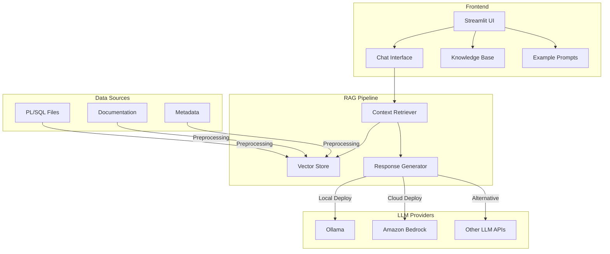
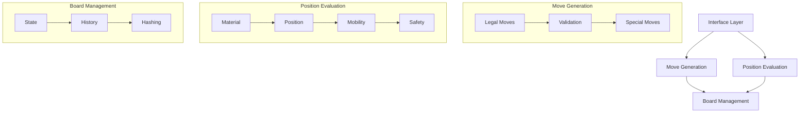
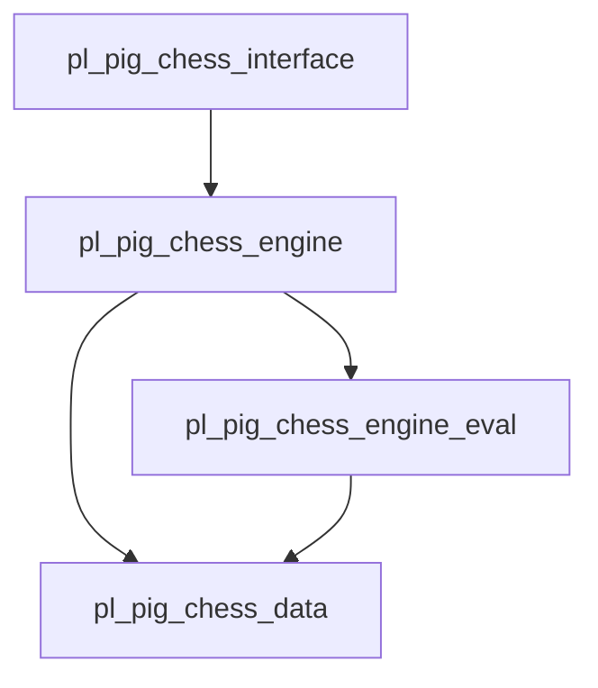
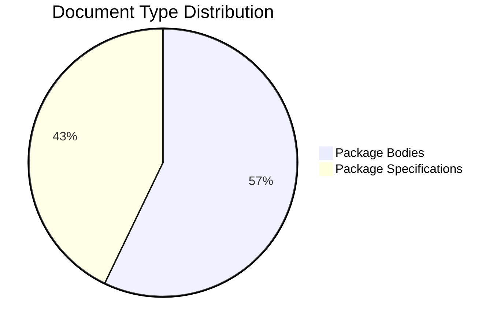

# PL/SQL Chess Engine RAG Chat Assistant 🤖♟️

## Overview
The PL/SQL Chess Engine RAG Chat Assistant is a specialized tool designed to help developers understand and interact with complex PL/SQL-based chess engine code. Using Retrieval-Augmented Generation (RAG) and local LLM capabilities, this tool provides intelligent, context-aware responses about chess engine implementation details, algorithms, and code structure.

## Demo


## Approach & Implementation Strategy 🧠

### Knowledge Base Creation
1. **Document Collection**: Gathered all PL/SQL source files, documentation, and related materials.
2. **Preprocessing Pipeline**:
   - Parse PL/SQL files to extract procedures, functions, and packages
   - Generate structured metadata about code components
   - Create embeddings for code segments and documentation

### RAG Implementation
1. **Vector Store Creation**:
   - Used FAISS for efficient similarity search
   - Implemented custom hash-based embeddings for testing
   - Created preprocessor notebook for on-demand vector generation

2. **Context Retrieval**:
   - Implemented intelligent chunk retrieval based on query similarity
   - Added metadata enrichment for better context understanding
   - Optimized chunk size and overlap for code understanding

3. **Response Generation**:
   - Integrated with LLM (Ollama/Bedrock) for response generation
   - Added prompt engineering for code-specific responses
   - Implemented conversation memory for context retention

## Tech Stack 🛠️

### Core Components
- **Frontend**: Streamlit (Fast prototyping, rich UI components)
- **Vector Store**: FAISS (Efficient similarity search, local deployment)
- **LLM Integration**: 
  - Ollama (Local deployment, privacy-focused)
  - Amazon Bedrock (Enterprise-grade, managed service)
- **Framework**: LangChain (RAG implementation, chat memory)
- **Development**: Jupyter Notebooks (Vector store generation)

### Advantages of Our Stack

#### Local LLM (Ollama)
- Complete data privacy and security
- No external API dependencies
- Customizable model selection
- Cost-effective for high usage

#### Vector Store (FAISS)
- Efficient similarity search
- Local deployment option
- Excellent performance for code embeddings
- Easy integration with LangChain

#### Streamlit
- Rapid development and prototyping
- Rich UI components out of the box
- Easy deployment and sharing
- Active community and support

## Architecture 🏗️



## Project Structure 📁
```
plsql-rag-chat/
├── data/                          # Data storage
│   ├── vectorstore/               # FAISS vector store
│   │   ├── index.faiss           # Vector indexes
│   │   └── index.pkl             # Metadata pickle file
│   ├── chat_histories/           # Saved chat sessions
│   └── metadata/                 # Chess engine metadata
│       └── chess_metadata.json   # Component metadata
├── docs/                         # Documentation
│   ├── images/                   # Documentation images
│   └── knowledge_base.md         # Wiki-style documentation
├── notebooks/                    # Jupyter notebooks
│   ├── document_preprocessor.ipynb    # Vector store generation
│   └── documentation-generator.ipynb  # Documentation tools
├── plsql_rag_chat/              # Main package
│   ├── config/                  # Configuration
│   │   ├── __init__.py
│   │   └── settings.py         # App settings
│   └── lib/                    # Library modules
│       ├── embeddings/         # Embedding handlers
│       ├── llm_handlers/       # LLM integration
│       ├── ui/                 # UI components
│       └── utils/              # Utility functions
├── .env                        # Environment variables
├── .env.example               # Environment template
├── requirements.txt           # Python dependencies
└── setup.py                  # Package setup
```

## Chat Assistant Features 🎯

### 1. Interactive Query Interface
- Real-time code-aware responses
- Context-aware conversation memory
- Code snippet display with syntax highlighting
- Source reference tracking

### 2. Knowledge Base Integration
- Wiki-style documentation browser
- Quick navigation between sections
- Integrated example queries
- Component documentation

### 3. Code Analysis
- Function and procedure exploration
- Algorithm explanation
- Implementation details
- Performance considerations

### 4. Visual Components
- Chess engine component explorer
- Package dependency visualization
- Code structure navigation
- Interactive examples

## Query Examples 🔍

### Architecture Queries
```plaintext
Q: "Explain the overall architecture of the chess engine"
Q: "How does the move generation system work?"
Q: "What are the main components and their interactions?"
```

### Implementation Queries
```plaintext
Q: "Show me how castling is implemented"
Q: "Explain the position evaluation algorithm"
Q: "How are valid moves calculated?"
```

### Code Navigation
```plaintext
Q: "List all procedures in the move generation package"
Q: "Show me the implementation of piece movement"
Q: "Explain the board representation data structure"
```

### Problem-Solving
```plaintext
Q: "What's the process for validating a move?"
Q: "How does the engine handle pawn promotion?"
Q: "Explain the checkmate detection algorithm"
```

## Chess Engine Components 🧩

### Core Packages

#### 1. Move Generation (pl_pig_chess_engine)
- Legal move calculation
- Move validation
- Special move handling
  - Castling
  - En passant
  - Pawn promotion

#### 2. Position Evaluation (pl_pig_chess_engine_eval)
- Material evaluation
- Position scoring
- Piece-square tables
- Mobility analysis

#### 3. Board Management (pl_pig_chess_data)
- Board representation
- Game state management
- Move history
- Position hashing

#### 4. Interface Layer (pl_pig_chess_interface)
- External API
- Move input/output
- Game control
- Status reporting

### Component Interactions



### Package Dependencies


## Development Workflow 🔄

### 1. Environment Setup
```bash
# Create and activate environment
conda create -n rag-chat python=3.11
conda activate rag-chat

# Install dependencies
pip install -e .
```

### 2. Vector Store Generation
```bash
# Run preprocessing notebook
jupyter notebook notebooks/document_preprocessor.ipynb

# Verify vector store
ls -la data/vectorstore/
```

### 3. Running the Application
```bash
# Start Ollama (if using local LLM)
ollama pull llama2
ollama run llama2

# Start the application
streamlit run plsql_rag_chat/app.py
```

### 4. Development Cycle
```bash
# Clean cache before testing changes
./scripts/clean_cache.sh

# Update dependencies
pip install -e .

# Run application with debug logging
streamlit run plsql_rag_chat/app.py --log_level=debug
```

## Local Setup with Ollama 🚀

1. **Prerequisites**:
```bash
# Install Ollama
curl https://ollama.ai/install.sh | sh

# Pull required model
ollama pull llama2:latest

# Clone repository
git clone https://github.com/ravishan16/plsql-rag-chat.git
cd plsql-rag-chat

# Create virtual environment
conda create -n rag-chat python=3.11
conda activate rag-chat
```

2. **Install Dependencies**:
```bash
pip install -e .
```

3. **Setup Environment**:
```bash
cp .env.example .env
# Edit .env file with your configuration
```

4. **Generate Vector Store**:
```bash
jupyter notebook notebooks/document_preprocessor.ipynb
# Run all cells to generate vector store
```

5. **Run Application**:
```bash
streamlit run plsql_rag_chat/app.py
```

## Amazon Bedrock Setup ☁️

1. **AWS Configuration**:
```bash
# Configure AWS credentials
aws configure

# Set environment variables
export AWS_REGION=us-east-1
export AWS_PROFILE=your-profile
```

2. **Update Environment**:
```bash
# Update .env file
LLM_PROVIDER=bedrock
BEDROCK_MODEL_ID=anthropic.claude-v2
AWS_REGION=us-east-1
```

3. **Run Application**:
```bash
streamlit run plsql_rag_chat/app.py
```

## Developer Guide 🛠️

### Environment Templates

**.env.example**:
```bash
# LLM Configuration
LLM_PROVIDER=ollama  # or bedrock
OLLAMA_BASE_URL=http://localhost:11434
MODEL_NAME=llama2

# Vector Store
VECTOR_STORE_PATH=./data/vectorstore
METADATA_PATH=./data/metadata/chess_metadata.json

# Model Parameters
DEFAULT_TEMPERATURE=0.7
DEFAULT_CONTEXT_LENGTH=2048
DEFAULT_TOP_K=40
DEFAULT_RETRIEVAL_K=3
```

### Useful Commands

**Clean Python Cache**:
```bash
find . -type d -name "__pycache__" -exec rm -r {} + && find . -type f -name "*.pyc" -delete
```

**Reset Environment**:
```bash
# Remove existing environment
conda deactivate
conda env remove -n rag-chat

# Create fresh environment
conda create -n rag-chat python=3.11
conda activate rag-chat
pip install -e .
```

## Contributors 👥

- Ravishankar Sivasubramaniam (@ravishan16)
- Vindhan Sahayam (@mvvsahayam)

## 📊 Vector Store Statistics

- Total Documents: 7 PL/SQL files
- Total Chunks: 1,665
- Embedding Dimension: 384
- Vector Store Size: ~4.9MB
- Document Types:
  - Package Bodies (.pkb): 4 files
  - Package Specifications (.pks): 3 files

### Document Distribution
